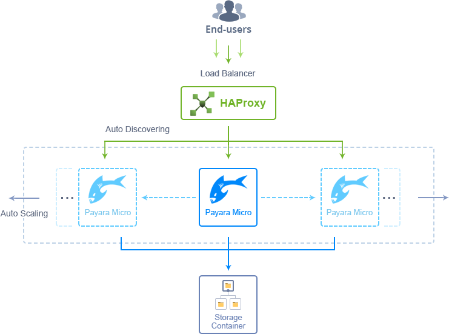
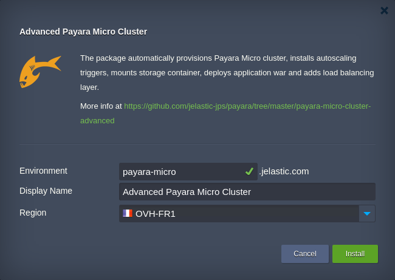

#Payara Micro Cluster - Advanced Package

### Load Balancing + Autoscaling triggers + Shared Storage 

Reliable and auto-scalable [Payara Micro](http://www.payara.fish/payara_micro) cluster with preconfigured alerts on high load, bound Data Storage container, inbuilt new servers auto-discovery at load balancing layer and example apps for load testing.

##Payara Micro Cluster Topology

Payara Micro Cluster package contains the minimal required amount of instances by default, but includes all the necessary tools for easy growth upon the necessity to handle the increased amount of incoming traffic.

This solution is build on top of [Docker containers](https://docs.jelastic.com/dockers-overview), leveraging the following images:
* _jelastic/payara-micro-cluster_ - Payara Micro application server (1 instance by default, to be [automatically scaled out](https://docs.jelastic.com/automatic-horizontal-scaling) horizontally when the load raises)
* _jelastic/haproxy-managed-lb_ - HAProxy load balancer, preconfigured for auto-detection of changing containers number in application server layer to automatically add/remove them within load balancing configs
* _jelastic/storage_ - [Dedicated Data Storage](https://docs.jelastic.com/dedicated-storage) container for storing custom data; it also contains a number of applications to test the main cluster scaling possibilities 

Additionally, as a basic benefit of hosting at Jelastic Cloud Platform, the [automatic vertical scaling](https://docs.jelastic.com/automatic-vertical-scaling) (from 1 to 16 cloudlets for this package) and [load alerts](https://docs.jelastic.com/load-alerts) notifications are applied to all containers by default. Obviously, upon the necessity, each of these predefined settings can be tuned up to your needs via the appropriate dashboard sections.

##Auto-Scaling Configuration

Payara Micro cluster package automatically adjusts the number of compute nodes based on current load (up to 10 instances per layer) according to the following conditions:
* +1 node if CPU usage is >70% for at least 1 minute
* +1 node if RAM usage is >70% for at least 1 minute
* -1 node if CPU usage <30% for at least 1 minute
* -1 node if RAM usage <30% for at least 1 minute

The appropriate modifications are automatically applied to the HAProxy Load Balancer configs to include/exclude Payara Micro nodes from the routing, whilst you receive the appropriate email notification upon each executed scaling operation.

In case you’d like to change the conditions of automatic nodes’ scaling manually, refer to the appropriate triggers’ parameters within the [Automatic Horizontal Scaling](https://docs.jelastic.com/automatic-horizontal-scaling) settings section.

##Load Testing with Default Apps

Advanced Payara Micro Cluster solution is provisioned with 3 .war applications - example **Hello World**, deployed to the server by default, and two separate testing tools for **RAM** and **CPU**. All of them are stored within the **deployments** Storage folder, that is [mounted](https://docs.jelastic.com/mount-points) to the app server layer.

The mentioned load testing simulators can be used to check how your cluster is adapted to handle load spikes. The process of new nodes’ automatic addition/removal can be tracked via the in-built dashboard tools: [statistics monitoring](https://docs.jelastic.com/view-app-statistics), [log files](https://docs.jelastic.com/view-log-files) and [scaling triggers history](https://docs.jelastic.com/automatic-horizontal-scaling#history).

###RAM Loading

In order to run memory test, open the following link in your browser:

_http://**{env.domain}**/ram/loader?mem=**{RAM}**&duration=**{time}**_

where
* _**{env.domain}**_ - domain of your environment
* _**{RAM}**_ - amount of RAM load to send (in MiB)
* _**{time}**_ - testing duration (in seconds)

###CPU Loading

To initiate CPU load simulation, execute the link of the next type:

_http://**{env.domain}**/cpu/?threads=**{threads}**&duration=**{time}**_

where
* _**{env.domain}**_ - domain of your environment
* _**{threads}**_ - number of parallel CPU threads
* _**{time}**_ - testing duration (in seconds)

##How to Install Advanced Payara Micro Cluster

The Payara Micro Cluster package deployment is completely automated and available for everyone:
* in case you don’t have Jelastic account yet, click on the button below to easily create a trial one and initiate the solution deployment:

* if you are an already registered user, just log in to the Platform dashboard and [import](https://docs.jelastic.com/environment-import) the manifest file from above:

_https://github.com/jelastic-jps/payara/blob/master/payara-micro-cluster-advanced/manifest.jps_

After confirmation, wait for a couple of minutes for Jelastic to create the appropriate containers and apply the required scaling automation settings.

